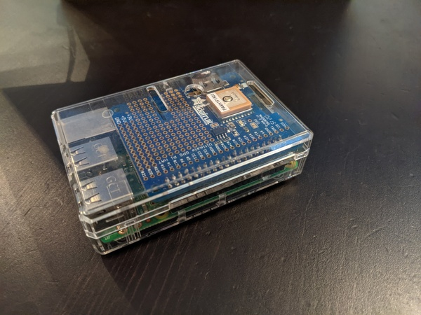

# magicarpi

**magicarpi** is an on-the-go wireless network data collector.

It runs persistently on a portable device and constantly scans for wireless networks. It logs any found along with their ESSID, MAC address, channel, signal strength and loss, authentication type, and (using the GPS module) the current time, latitude, and longitude.

This data could then be used to plot a map of wireless networks and their locations, or to perform data analysis of the popularity and variety of used ESSIDs.

## Requirements

A portable device (Raspberry Pi recommended) with a GPS and wireless networking module.



## Usage

Clone this repository on your device.

Tweak and install the `files/magicarpi@.service` systemd unit file. Set the `MAGICARPI_DB` environment variable to an ActiveRecord-compatible SQL connection string, and seed the database with `db/schema.sql`.

Start the service and pass the serial device the GPS module is outputting to.

```bash
sudo systemctl enable --now magicarpi@serial0
```

Note the codebase currently assumes that `wlan0` is the wireless device.

## Misc

### Duplicates

If the same network is seen more than once within any 10 minute period it will not be logged again.

### System clock

GPS is used to keep the system's clock in sync so no RTC is necessary.

### Table structure

The primary table, `wireless_network_logs`, stores the records of each network found.

```
id          int(11)
created     datetime
essid       varchar(512)
mac_address varchar(64)
channel     int(11)
signal_loss varchar(64)
auth        varchar(64)
lat         varchar(64)
lng         varchar(64)
hdop        decimal(10,3)
vdop        decimal(10,3)
pdop        decimal(10,3)
```

A second table, `wireless_network_dumps`, stores the raw data from the network scans.

```
id                      int(11)
wireless_network_log_id int(11)
content                 text
```

## Bugs or contributions

Open an [issue](https://github.com/crdx/magicarpi/issues) or send a [pull request](https://github.com/crdx/magicarpi/pulls).

## Licence

[MIT](LICENCE.md).
